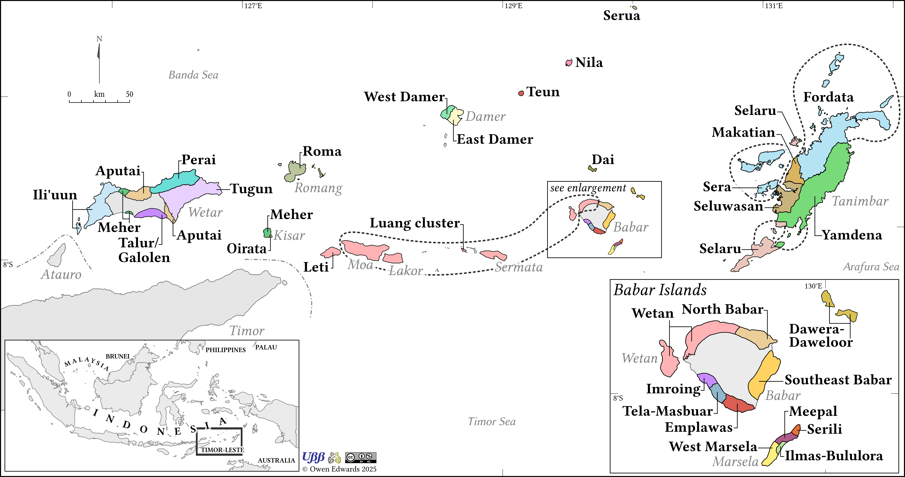

 
## Maps of Eastern Indonesia and Timor Leste

::: {layout-ncol=2}

![Languages of Alor and Pantar [\[PDF\]](https://drive.google.com/file/d/1RObEFAsgkCBPW9GQHiVoX9yXdkMCBgIM/view)](images/Alor-Pantar-ENG.png){width=300}

![Meto varieties [\[PDF\]](https://drive.google.com/file/d/1avUB6wbePFdPOFNzG5KkdXZxN408vFIM/view)](images/Metos.png ){width=250}
:::

::: {layout-ncol=2}

![Languages of Greater Timor and Rote [\[PDF\]](https://drive.google.com/file/d/15oWI9u6HqnWdJcppLmXxQjDYcUDTx5It/view)
](images/Timor-Rote.png){width=300}

{width=300}
:::

![Languages of Nussa Tenggar Timor and Timor-Leste[\[PDF\]](https://drive.google.com/file/d/1SjwUGM6Vzo3-edV-nzXNYCDF_l1gTOll/view)](images/NTT-TL-Languages-ENG.png){width=500}

 
## Maps from *The Austronesian languages of eastern Indonesia and Timor-Leste: unravelling their prehistory and classification*
These are select maps from the book: The Austronesian languages of eastern Indonesia and Timor-Leste: unravelling their prehistory and classification published by Language Science Press available to download [here](https://langsci-press.org/catalog/book/526).

::: {layout-ncol=2}

![Linguistic Wallacea [\[PDF\]](https://github.com/OwenAmarasi/Maps-from-The-Austronesian-languages-of-eastern-Indonesia-and-Timor-Leste/blob/main/Fig-01-4-LingWallacea.pdf) [\[PNG\]](https://github.com/OwenAmarasi/Maps-from-The-Austronesian-languages-of-eastern-Indonesia-and-Timor-Leste/blob/main/Fig-01-4-LingWallacea.png)](images/Fig-01-4-LingWallacea.png){width=300}

![Eastern Indonesia and Timor-Leste with subgroups [\[PDF\]](https://github.com/OwenAmarasi/Maps-from-The-Austronesian-languages-of-eastern-Indonesia-and-Timor-Leste/blob/main/Fig-01-5-eIN-TL-Subgroup.pdf) [\[PNG\]](https://github.com/OwenAmarasi/Maps-from-The-Austronesian-languages-of-eastern-Indonesia-and-Timor-Leste/blob/main/Fig-01-5-eIN-TL-Subgroup.png)](images/Fig-01-5-eIN-TL-Subgroup.png){width=300}
:::

::: {layout-ncol=2}

![Austronesian and Papuan languages in greater Timor [\[PDF\]](https://github.com/OwenAmarasi/Maps-from-The-Austronesian-languages-of-eastern-Indonesia-and-Timor-Leste/blob/main/Fig-02-5-AN-Pap-Timor.pdf) [\[PNG\]](https://github.com/OwenAmarasi/Maps-from-The-Austronesian-languages-of-eastern-Indonesia-and-Timor-Leste/blob/main/Fig-02-5-AN-Pap-Timor.png)](images/Fig-02-5-AN-Pap-Timor.png){width=300}

![Austronesian and Papuan languages in north Maluku [\[PDF\]](https://github.com/OwenAmarasi/Maps-from-The-Austronesian-languages-of-eastern-Indonesia-and-Timor-Leste/blob/main/Fig-02-6-AN-Pap-Halm.pdf) [\[PNG\]](https://github.com/OwenAmarasi/Maps-from-The-Austronesian-languages-of-eastern-Indonesia-and-Timor-Leste/blob/main/Fig-02-6-AN-Pap-Halm.png)](images/Fig-02-6-AN-Pap-Halm.png){width=200}
:::

::: {layout-ncol=2}

![Bima-Lembata languages [\[PDF\]](https://github.com/OwenAmarasi/Maps-from-The-Austronesian-languages-of-eastern-Indonesia-and-Timor-Leste/blob/main/Fig-03-1-BL-Langs.pdf) [\[PNG\]](https://github.com/OwenAmarasi/Maps-from-The-Austronesian-languages-of-eastern-Indonesia-and-Timor-Leste/blob/main/Fig-03-1-BL-Langs.png)](images/Fig-03-1-BL-Langs.png){width=300}

![Timor-Babar languages [\[PDF\]](https://github.com/OwenAmarasi/Maps-from-The-Austronesian-languages-of-eastern-Indonesia-and-Timor-Leste/blob/main/Fig-04-1-TB-Langs.pdf) [\[PNG\]](https://github.com/OwenAmarasi/Maps-from-The-Austronesian-languages-of-eastern-Indonesia-and-Timor-Leste/blob/main/Fig-04-1-TB-Langs.png)](images/Fig-04-1-TB-Langs.png){width=300}
:::

::: {layout-ncol=2}

![Aru languages [\[PDF\]](https://github.com/OwenAmarasi/Maps-from-The-Austronesian-languages-of-eastern-Indonesia-and-Timor-Leste/blob/main/Fig-06-1-Aru-Langs.pdf) [\[PNG\]](https://github.com/OwenAmarasi/Maps-from-The-Austronesian-languages-of-eastern-Indonesia-and-Timor-Leste/blob/main/Fig-06-1-Aru-Langs.png)](images/Fig-06-1-Aru-Langs.png){width=170}

![Locations of languages of central Maluku [\[PDF\]](https://github.com/OwenAmarasi/Maps-from-The-Austronesian-languages-of-eastern-Indonesia-and-Timor-Leste/blob/main/Fig-07-4-CentMal-Langs.pdf) [\[PNG\]](https://github.com/OwenAmarasi/Maps-from-The-Austronesian-languages-of-eastern-Indonesia-and-Timor-Leste/blob/main/Fig-07-4-CentMal-Langs.png)](images/Fig-07-4-CentMal-Langs.png){width=300}
:::

::: {layout-ncol=2}

![Taliabu and nearby languages [\[PDF\]](https://github.com/OwenAmarasi/Maps-from-The-Austronesian-languages-of-eastern-Indonesia-and-Timor-Leste/blob/main/Fig-08-2-Tal-Langs.pdf) [\[PNG\]](https://github.com/OwenAmarasi/Maps-from-The-Austronesian-languages-of-eastern-Indonesia-and-Timor-Leste/blob/main/Fig-08-2-Tal-Langs.png)](images/Fig-08-2-Tal-Langs.png){width=300}

![Seram-Tanimbar-Bomberai languages and Banda [\[PDF\]](https://github.com/OwenAmarasi/Maps-from-The-Austronesian-languages-of-eastern-Indonesia-and-Timor-Leste/blob/main/Fig-11-3-STB-Langs.pdf) [\[PNG\]](https://github.com/OwenAmarasi/Maps-from-The-Austronesian-languages-of-eastern-Indonesia-and-Timor-Leste/blob/main/Fig-11-3-STB-Langs.png)](images/Fig-11-3-STB-Langs.png){width=300}

:::
 

## Maps from *The Oxford Guide to the Malayo-Polynesian Languages of Southeast Asia*

These are the maps from the [Oxford Guide to the Malayo-Polynesian Languages of Southeast Asia](https://global.oup.com/academic/product/the-oxford-guide-to-the-malayo-polynesian-languages-of-southeast-asia-9780198807353?cc=nz&lang=en&). They are made available here for the use of authors and others who may want to use the maps. While the volume itself is behind a paywall, 
The maps are licensed as [CC BY-NC 4.0](https://creativecommons.org/licenses/by-nc/4.0/),
meaning you are free to redistribute and adapt the maps, as long as you provide appropriate attribution to the creator 
(Owen Edwards) and do not use them for commercial purposes. 
If you are reusing a map in an academic publication or presentation, probably the best way to cite it would be something like: "
Map by Owen Edwards from XXX" where XXX is the citation to the the chapter the map appears in.

::: {layout-ncol=2}
![The Rivers of Borneo [\[PDF\]](https://github.com/OwenAmarasi/Maps-from-the-Oxford-Guide-to-the-Malayo-Polynesian-Languages-of-Southeast-Asia/blob/main/08-1_BorneoRivers.pdf) [\[PNG\]](https://github.com/OwenAmarasi/Maps-from-the-Oxford-Guide-to-the-Malayo-Polynesian-Languages-of-Southeast-Asia/blob/main/08-1_BorneoRivers.png)](images/1BorneoRivers.png){width=200}

![The Rejang river and its tributaries [\[PDF\]](https://github.com/OwenAmarasi/Maps-from-the-Oxford-Guide-to-the-Malayo-Polynesian-Languages-of-Southeast-Asia/blob/main/08-2_RejangRiver.pdf) [\[PNG\]](https://github.com/OwenAmarasi/Maps-from-the-Oxford-Guide-to-the-Malayo-Polynesian-Languages-of-Southeast-Asia/blob/main/08-2_RejangRiver.png)](images/2RejangRiver.png){width=300}

:::

::: {layout-ncol=2}
![Current distribution of vernacular Malayic [\[PDF\]](https://github.com/OwenAmarasi/Maps-from-the-Oxford-Guide-to-the-Malayo-Polynesian-Languages-of-Southeast-Asia/blob/main/09-1_Malay.pdf) [\[PNG\]](https://github.com/OwenAmarasi/Maps-from-the-Oxford-Guide-to-the-Malayo-Polynesian-Languages-of-Southeast-Asia/blob/main/09-1_Malay.png)](images/3Malay.png){width=300}

![Languages of Mainland Southeast Asia and Sumatra mentioned in Chapter 20 [\[PDF\]](https://github.com/OwenAmarasi/Maps-from-the-Oxford-Guide-to-the-Malayo-Polynesian-Languages-of-Southeast-Asia/blob/main/20-1_MSEA.pdf) [\[PNG\]](https://github.com/OwenAmarasi/Maps-from-the-Oxford-Guide-to-the-Malayo-Polynesian-Languages-of-Southeast-Asia/blob/main/20-1_MSEA.png)](images/4MSEA.png){width=300}

:::

::: {layout-ncol=2}
![Languages in Madagascar, Comoros, and African East Coast referred to in Chapter 21 [\[PDF\]](https://github.com/OwenAmarasi/Maps-from-the-Oxford-Guide-to-the-Malayo-Polynesian-Languages-of-Southeast-Asia/blob/main/21-1_Madagascar.pdf) [\[PNG\]](https://github.com/OwenAmarasi/Maps-from-the-Oxford-Guide-to-the-Malayo-Polynesian-Languages-of-Southeast-Asia/blob/main/21-1_Madagascar.png)](images/5Madagascar.png){width=300}

![Papuan language families on and around the Bird’s Head of New Guinea [\[PDF\]](https://github.com/OwenAmarasi/Maps-from-the-Oxford-Guide-to-the-Malayo-Polynesian-Languages-of-Southeast-Asia/blob/main/22-1_Papuan.pdf) [\[PNG\]](https://github.com/OwenAmarasi/Maps-from-the-Oxford-Guide-to-the-Malayo-Polynesian-Languages-of-Southeast-Asia/blob/main/22-1_Papuan.png)](images/6Papuan.png){width=300}

:::

::: {layout-ncol=2}

![Northern Philippine languages [\[PDF\]](https://github.com/OwenAmarasi/Maps-from-the-Oxford-Guide-to-the-Malayo-Polynesian-Languages-of-Southeast-Asia/blob/main/24-1_NPhilippine.pdf) [\[PNG\]](https://github.com/OwenAmarasi/Maps-from-the-Oxford-Guide-to-the-Malayo-Polynesian-Languages-of-Southeast-Asia/blob/main/24-1_NPhilippine.png)](images/7NPhilippine.png){width=300}

![Languages of central and southern Philippines [\[PDF\]](https://github.com/OwenAmarasi/Maps-from-the-Oxford-Guide-to-the-Malayo-Polynesian-Languages-of-Southeast-Asia/blob/main/25-1_Philippines.pdf) [\[PNG\]](https://github.com/OwenAmarasi/Maps-from-the-Oxford-Guide-to-the-Malayo-Polynesian-Languages-of-Southeast-Asia/blob/main/25-1_Philippines.png)](images/8Philippines.png){width=300}
:::

::: {layout-ncol=2}

![Legend for Languages of central and southern Philippines [\[PDF\]](https://github.com/OwenAmarasi/Maps-from-the-Oxford-Guide-to-the-Malayo-Polynesian-Languages-of-Southeast-Asia/blob/main/25-1_PhilippinesLegend.pdf) [\[PNG\]](https://github.com/OwenAmarasi/Maps-from-the-Oxford-Guide-to-the-Malayo-Polynesian-Languages-of-Southeast-Asia/blob/main/25-1_PhilippinesLegend.png)](images/9PhilippinesLegend.png){width=300}

![The Sama-Bajaw languages [\[PDF\]](https://github.com/OwenAmarasi/Maps-from-the-Oxford-Guide-to-the-Malayo-Polynesian-Languages-of-Southeast-Asia/blob/main/26-1_Sama.pdf) [\[PNG\]](https://github.com/OwenAmarasi/Maps-from-the-Oxford-Guide-to-the-Malayo-Polynesian-Languages-of-Southeast-Asia/blob/main/26-1_Sama.png)](images/10Sama.png){width=300}
:::

::: {layout-ncol=2}

![The non-Malayic languages of Borneo [\[PDF\]](https://github.com/OwenAmarasi/Maps-from-the-Oxford-Guide-to-the-Malayo-Polynesian-Languages-of-Southeast-Asia/blob/main/27-1_BorneoLang.pdf) [\[PNG\]](https://github.com/OwenAmarasi/Maps-from-the-Oxford-Guide-to-the-Malayo-Polynesian-Languages-of-Southeast-Asia/blob/main/27-1_BorneoLang.png)](images/11BorneoLang.png){width=300}

![Location of NMLS in Sumatra and the Barrier Islands [\[PDF\]](https://github.com/OwenAmarasi/Maps-from-the-Oxford-Guide-to-the-Malayo-Polynesian-Languages-of-Southeast-Asia/blob/main/28-1_Sumatra.pdf) [\[PNG\]](https://github.com/OwenAmarasi/Maps-from-the-Oxford-Guide-to-the-Malayo-Polynesian-Languages-of-Southeast-Asia/blob/main/28-1_Sumatra.png)](images/12Sumatra.png){width=300}
:::

::: {layout-ncol=2}

![The Malayic languages [\[PDF\]](https://github.com/OwenAmarasi/Maps-from-the-Oxford-Guide-to-the-Malayo-Polynesian-Languages-of-Southeast-Asia/blob/main/29-1_Malayic.pdf) [\[PNG\]](https://github.com/OwenAmarasi/Maps-from-the-Oxford-Guide-to-the-Malayo-Polynesian-Languages-of-Southeast-Asia/blob/main/29-1_Malayic.png)](images/13Malayic.png){width=300}

![Current distribution of Chamic languages in communes with more than 200 speakers [\[PDF\]](https://github.com/OwenAmarasi/Maps-from-the-Oxford-Guide-to-the-Malayo-Polynesian-Languages-of-Southeast-Asia/blob/main/30-1_Chamic.pdf) [\[PNG\]](https://github.com/OwenAmarasi/Maps-from-the-Oxford-Guide-to-the-Malayo-Polynesian-Languages-of-Southeast-Asia/blob/main/30-1_Chamic.png)](images/14Chamic.png){width=300}
:::

::: {layout-ncol=2}

![The languages of Java and dialect groups of Javanese [\[PDF\]](https://github.com/OwenAmarasi/Maps-from-the-Oxford-Guide-to-the-Malayo-Polynesian-Languages-of-Southeast-Asia/blob/main/31-1_Java.pdf) [\[PNG\]](https://github.com/OwenAmarasi/Maps-from-the-Oxford-Guide-to-the-Malayo-Polynesian-Languages-of-Southeast-Asia/blob/main/31-1_Java.png)](images/15Java.png){width=300}

![The languages of Bali, Lombok and Sumbawa [\[PDF\]](https://github.com/OwenAmarasi/Maps-from-the-Oxford-Guide-to-the-Malayo-Polynesian-Languages-of-Southeast-Asia/blob/main/32-1_Bali-NTB.pdf) [\[PNG\]](https://github.com/OwenAmarasi/Maps-from-the-Oxford-Guide-to-the-Malayo-Polynesian-Languages-of-Southeast-Asia/blob/main/32-1_Bali-NTB.png)](images/16BaliNTB.png){width=300}
:::

::: {layout-ncol=2}

![Sulawesi microgroups [\[PDF\]](https://github.com/OwenAmarasi/Maps-from-the-Oxford-Guide-to-the-Malayo-Polynesian-Languages-of-Southeast-Asia/blob/main/33-1_SulawesiGroups.pdf) [\[PNG\]](https://github.com/OwenAmarasi/Maps-from-the-Oxford-Guide-to-the-Malayo-Polynesian-Languages-of-Southeast-Asia/blob/main/33-1_SulawesiGroups.png)](images/17SulawesiGroups.png){width=300}

![Sulawesi languages [\[PDF\]](https://github.com/OwenAmarasi/Maps-from-the-Oxford-Guide-to-the-Malayo-Polynesian-Languages-of-Southeast-Asia/blob/main/33-2_SulawesiLanguages.pdf) [\[PNG\]](https://github.com/OwenAmarasi/Maps-from-the-Oxford-Guide-to-the-Malayo-Polynesian-Languages-of-Southeast-Asia/blob/main/33-2_SulawesiLanguages.png)](images/18SulawesiLanguages.png){width=300}
:::

::: {layout-ncol=2}

![Sulawesi languages legend [\[PDF\]](https://github.com/OwenAmarasi/Maps-from-the-Oxford-Guide-to-the-Malayo-Polynesian-Languages-of-Southeast-Asia/blob/main/33-2_SulawesiLegend.pdf) [\[PNG\]](https://github.com/OwenAmarasi/Maps-from-the-Oxford-Guide-to-the-Malayo-Polynesian-Languages-of-Southeast-Asia/blob/main/33-2_SulawesiLegend.png)](images/19SulawesiLegend.png){width=300}

![Languages of Flores and its satellites [\[PDF\]](https://github.com/OwenAmarasi/Maps-from-the-Oxford-Guide-to-the-Malayo-Polynesian-Languages-of-Southeast-Asia/blob/main/34-1_Flores.pdf) [\[PNG\]](https://github.com/OwenAmarasi/Maps-from-the-Oxford-Guide-to-the-Malayo-Polynesian-Languages-of-Southeast-Asia/blob/main/34-1_Flores.png)](images/20Flores.png){width=300}
:::

::: {layout-ncol=2}

![Languages of Timor and southern Maluku discussed in Chapter 35 [\[PDF\]](https://github.com/OwenAmarasi/Maps-from-the-Oxford-Guide-to-the-Malayo-Polynesian-Languages-of-Southeast-Asia/blob/main/35-1_TimorSMaluku.pdf) [\[PNG\]](https://github.com/OwenAmarasi/Maps-from-the-Oxford-Guide-to-the-Malayo-Polynesian-Languages-of-Southeast-Asia/blob/main/35-1_TimorSMaluku.png)](images/21TimorSMaluku.png){width=300}

![Languages in the central Maluku region [\[PDF\]](https://github.com/OwenAmarasi/Maps-from-the-Oxford-Guide-to-the-Malayo-Polynesian-Languages-of-Southeast-Asia/blob/main/36-1_CMaluku.pdf) [\[PNG\]](https://github.com/OwenAmarasi/Maps-from-the-Oxford-Guide-to-the-Malayo-Polynesian-Languages-of-Southeast-Asia/blob/main/36-1_CMaluku.png)](images/22CMaluku.png){width=300}
:::

::: {layout-ncol=2}

![The Austronesian languages of Halmahera and West New Guinea [\[PDF\]](https://github.com/OwenAmarasi/Maps-from-the-Oxford-Guide-to-the-Malayo-Polynesian-Languages-of-Southeast-Asia/blob/main/37-1_SHWNG.pdf) [\[PNG\]](https://github.com/OwenAmarasi/Maps-from-the-Oxford-Guide-to-the-Malayo-Polynesian-Languages-of-Southeast-Asia/blob/main/37-1_SHWNG.png)](images/23SHWNG.png){width=300}

![Boundaries of Malagasy subgroupings [\[PDF\]](https://github.com/OwenAmarasi/Maps-from-the-Oxford-Guide-to-the-Malayo-Polynesian-Languages-of-Southeast-Asia/blob/main/40-1_Malagasy.pdf) [\[PNG\]](https://github.com/OwenAmarasi/Maps-from-the-Oxford-Guide-to-the-Malayo-Polynesian-Languages-of-Southeast-Asia/blob/main/40-1_Malagasy.png)](images/24Malagasy.png){width=150}
:::

::: {layout-ncol=2}

![Order of possessor and possessum [\[PDF\]](https://github.com/OwenAmarasi/Maps-from-the-Oxford-Guide-to-the-Malayo-Polynesian-Languages-of-Southeast-Asia/blob/main/48-1_poss.pdf) [\[PNG\]](https://github.com/OwenAmarasi/Maps-from-the-Oxford-Guide-to-the-Malayo-Polynesian-Languages-of-Southeast-Asia/blob/main/48-1_poss.png)](images/25poss.png){width=300}

![Locus and marking of possessive relationship where possessor and possessum are expressed with nouns [\[PDF\]](https://github.com/OwenAmarasi/Maps-from-the-Oxford-Guide-to-the-Malayo-Polynesian-Languages-of-Southeast-Asia/blob/main/48-2_poss.pdf) [\[PNG\]](https://github.com/OwenAmarasi/Maps-from-the-Oxford-Guide-to-the-Malayo-Polynesian-Languages-of-Southeast-Asia/blob/main/48-2_poss.png)](images/26poss.png){width=300}
:::

::: {layout-ncol=2}

![Differential possessive marking [\[PDF\]](https://github.com/OwenAmarasi/Maps-from-the-Oxford-Guide-to-the-Malayo-Polynesian-Languages-of-Southeast-Asia/blob/main/48-3_poss.pdf) [\[PNG\]](https://github.com/OwenAmarasi/Maps-from-the-Oxford-Guide-to-the-Malayo-Polynesian-Languages-of-Southeast-Asia/blob/main/48-3_poss.png)](images/27poss.png){width=300}

![Locations of languages in the survey according to primary orientation system type [\[PDF\]](https://github.com/OwenAmarasi/Maps-from-the-Oxford-Guide-to-the-Malayo-Polynesian-Languages-of-Southeast-Asia/blob/main/49-1_direction.pdf) [\[PNG\]](https://github.com/OwenAmarasi/Maps-from-the-Oxford-Guide-to-the-Malayo-Polynesian-Languages-of-Southeast-Asia/blob/main/49-1_direction.png)](images/28.png){width=300}
:::

::: {layout-ncol=2}

![Encoding of not yet in MPSEA languages [\[PDF\]](https://github.com/OwenAmarasi/Maps-from-the-Oxford-Guide-to-the-Malayo-Polynesian-Languages-of-Southeast-Asia/blob/main/51-1_notyet.pdf) [\[PNG\]](https://github.com/OwenAmarasi/Maps-from-the-Oxford-Guide-to-the-Malayo-Polynesian-Languages-of-Southeast-Asia/blob/main/51-1_notyet.png)](images/29notyet.png){width=300}

 
:::

